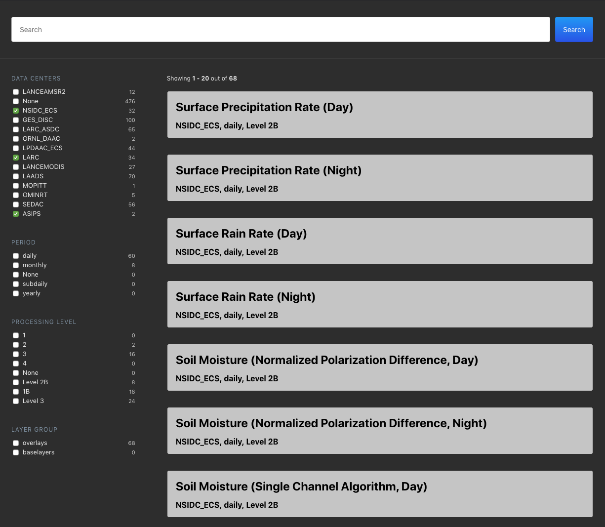

# What is this?

This repo is a rough example/demo of how to use the [elastic/search-ui library](https://github.com/elastic/search-ui) to quickly stand up a faceted filter based search UI without the use of a database or search API.  On the [NASA Worldview](https://github.com/nasa-gibs/worldview) project all of the data pertaining to our map layers are contained in a single JSON configuration file at deployment time, rather than behind an API.  Therefore, in order to build facet filter choices and counts, we needed to process that data within the UI layer.  For larger datasets this would not be reccommended but due to the relatively low number of map layer objects (~1000) this approach was simpler than the alternative.

 

 

This project was bootstrapped with [Create React App](https://github.com/facebook/create-react-app).

## Available Scripts

In the project directory, you can run:

### `npm start`

Runs the app in the development mode. 
Open [http://localhost:3000](http://localhost:3000) to view it in the browser.

The page will reload if you make edits. 
You will also see any lint errors in the console.

### `npm test`

Launches the test runner in the interactive watch mode. 
See the section about [running tests](https://facebook.github.io/create-react-app/docs/running-tests) for more information.

### `npm run build`

Builds the app for production to the `build` folder. 
It correctly bundles React in production mode and optimizes the build for the best performance.

The build is minified and the filenames include the hashes. 
Your app is ready to be deployed!

See the section about [deployment](https://facebook.github.io/create-react-app/docs/deployment) for more information.

